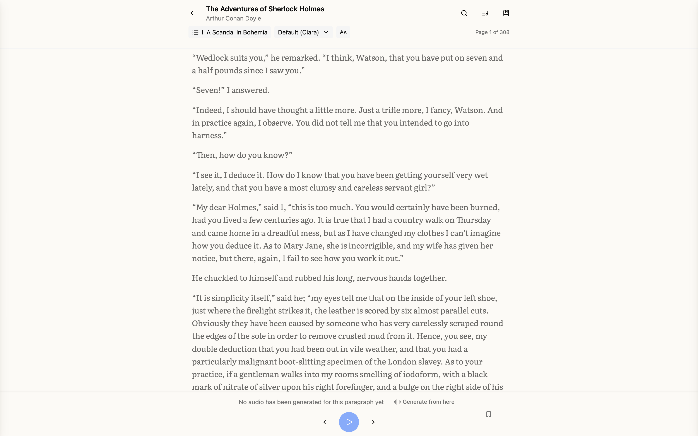
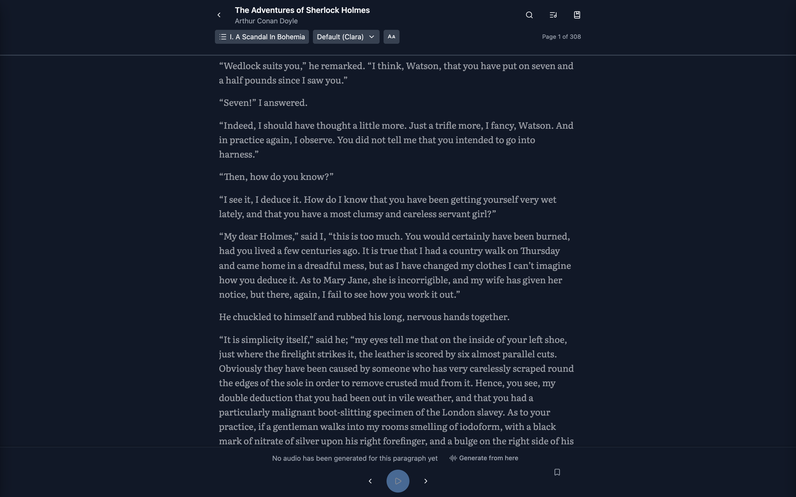
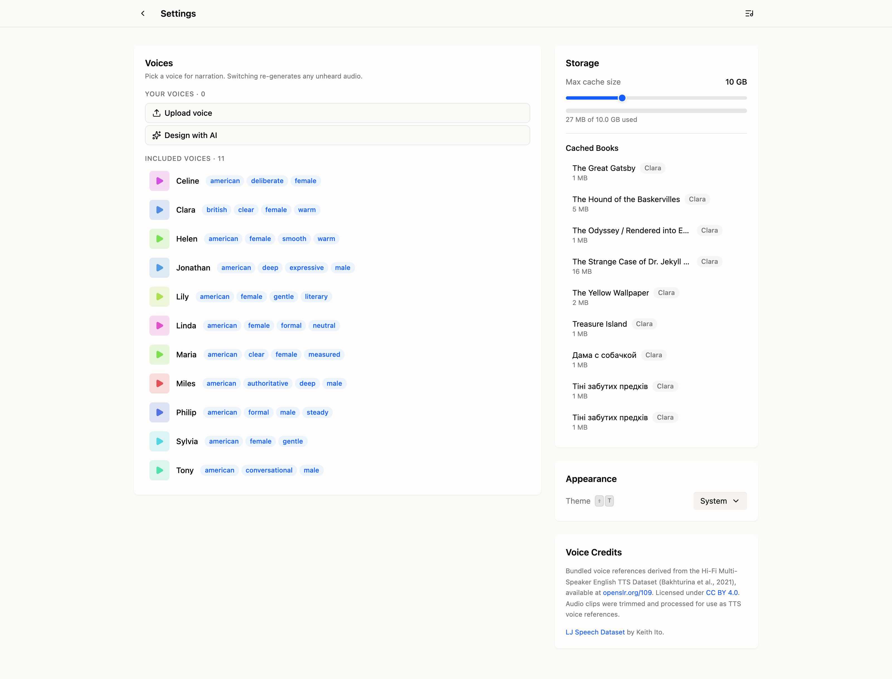

# InkVoice

Local EPUB reader that turns your books into audiobooks. Narration is generated on-device with neural TTS — no cloud, no accounts, no data leaving your Mac.


## Download

Grab the `.dmg` from the [latest release](https://github.com/carbonid1/inkvoice/releases/latest). Requires an Apple Silicon Mac.

InkVoice is unsigned and un-notarized — I don't have an Apple Developer account and don't plan to get one, so this is a **wontfix**. Because of it, macOS quarantines the download and refuses to launch, usually with **"InkVoice is damaged and can't be opened."** The app isn't actually damaged; macOS just won't run an unsigned downloaded app without a nudge, and for this particular error neither right-click → **Open** nor **Open Anyway** in System Settings clears it.

To get past it:

1. Drag **InkVoice** into your **Applications** folder.
2. Open **Terminal** and run:
   ```bash
   xattr -dr com.apple.quarantine /Applications/InkVoice.app
   ```
3. Launch InkVoice normally.

That strips the quarantine flag macOS added on download, after which the app opens like any other. You only need to do it once per install (repeat it after each update). If you dragged InkVoice somewhere other than `/Applications` — e.g. your user `~/Applications` folder — point the command at that path instead.

First launch downloads the TTS model (~1.6 GB) into `~/.cache/huggingface/`. Your books, generated audio, and settings live in `~/Library/Application Support/InkVoice/`.

## Features

- **EPUB library** — add your own books, or start reading with the bundled public-domain classics
- **On-device narration** — natural-sounding speech generated locally with OmniVoice TTS
- **11 voices included** — and you can add your own from a ~10-second reference recording
- **Pregeneration** — synthesize a whole book's audio ahead of time, within a storage budget you control
- **Reading progress and bookmarks** — pick up where you left off, in text or audio

|                        Reader                         |                    Generation queue                     |
| :---------------------------------------------------: | :-----------------------------------------------------: |
|  |  |

|                        Dark mode                         |                       Voices & storage                       |
| :------------------------------------------------------: | :----------------------------------------------------------: |
|  |  |

## Development

Prereqs: Node 22+, pnpm 11 (pinned via `packageManager`), Python 3.11.

```bash
pnpm install
python3.11 -m venv venv && source venv/bin/activate && pip install -r api/requirements.txt
pnpm dev
```

`pnpm dev` runs database migrations, starts the app at `http://localhost:49813`, and lazy-spawns the Python TTS server on demand.

| Command               | Purpose                      |
| --------------------- | ---------------------------- |
| `pnpm ts`             | TypeScript type-check        |
| `pnpm lint`           | ESLint                       |
| `pnpm test`           | Vitest                       |
| `pnpm e2e`            | Playwright E2E               |
| `pnpm electron:build` | Desktop app (.dmg → `dist/`) |

The desktop build downloads its own Node.js and Python runtimes on the first run and caches them (`dist-node/`, `dist-python/`); subsequent builds are much faster.

## Credits

Bundled voice references (`data/voices/`) are derived from the [Hi-Fi Multi-Speaker English TTS Dataset](http://openslr.org/109/) (Bakhturina et al., 2021), licensed under [CC BY 4.0](https://creativecommons.org/licenses/by/4.0/); audio clips were trimmed and processed for use as TTS voice references. Additional credit to the [LJ Speech Dataset](https://keithito.com/LJ-Speech-Dataset/) by Keith Ito.

## License

[MIT](LICENSE) — covers the code. Bundled voice data is CC BY 4.0 as noted above.
